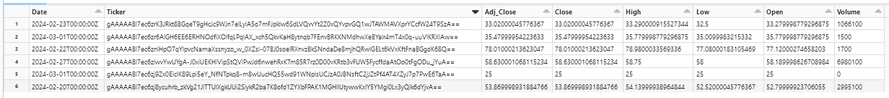

## **OBJETIVO DO CASE**

O objetivo deste case é a criação de uma ferramenta para monitorar as
ações listadas na B3, a bolsa de valores do Brasil, oferecendo
informações dinâmicas capazes de orientar o gerenciamento das carteiras
de investimento, realização de estudos sobre a performance de uma
determinada empresa do decorrer do tempo e auxiliar na tomada de decisão
dos investidores. A ferramenta também visa proporcionar uma análise
comparativa entre diferentes ativos, facilitando a identificação de
oportunidades de investimento e o acompanhamento de tendências do
mercado.

## **ARQUITETURA DE SOLUÇÃO**

A Arquitetura de Solução consiste em uma pipeline que segue os seguintes
passos:

-   Consumo dos dados de ações a partir de um API (para este projeto foi
    escolhida a yfinance).

-   Transformação dos dados, por meio de uma plataforma de computação
    distribuída

-   Armazenamento dos dados em um datalake, seguindo a **arquitetura
    medalhão** (Bronze, Silver e Gold).

-   Scheduling: para este processo rodar, serão criados **dois
    agendamentos**, um de nível horário e outro de nível diário. Tal
    distinção foi feita devido a uma peculiaridade da API, no qual os
    dados oficiais de fechamento do dia somente são retornados se o
    parâmetro de granularidade a nível diário for informado.

-   Consumo dos dados: por fim, os dados são utilizados para a criação
    de um Dashboard e também estão disponibilizados para análises.

## **ARQUITETURA TÉCNICA**

Para executar o projeto descrito na Arquitetura de Solução, foi
desenhada uma arquitetura totalmente baseada na Cloud da Azure. Abaixo
estão listadas as ferramentas escolhidas:

-   ADLS Gen2: é utilizado como o principal repositório de dados. Ele
    fornece uma **arquitetura hierárquica de armazenamento** que suporta
    dados estruturados e não estruturados. Em relação ao formato de
    dados para o armazenamento das tabelas, foi escolhido o Delta devido
    ao seu bom desempenho em tarefas de leitura e gravação e ao recurso
    de versionamento de dados.

-   Azure Data Factory (ADF): plataforma usada para orquestrar e
    automatizar os fluxos de trabalho de extração, transformação e carga
    dos dados. Aqui tem como principal função o Scheduling do processo.

-   Databricks (com Spark): Databricks é uma plataforma baseada em
    Apache Spark que oferece ambientes de trabalho colaborativos para
    análise de dados, machine learning e processamento de Big Data em
    escala. Neste projeto, ele fornece os clusters Spark necessários
    para o processamento dos dados.

-   Power BI: ferramenta de visualização de dados utilizada para criar o
    Dashboard que mostra os dados do Data Lake.

## **EXPLICAÇÃO SOBRE O CASE DESENVOLVIDO**
**1 - Pipeline de dados (Databricks)**

Os códigos se encontram na pasta Notebooks, que contém duas subpastas, a
Daily (que contém os códigos da pipeline horária) e a Hourly (que contém
os códigos da pipeline diária). Os códigos das duas pastas são quase
idênticos, com exceção do parâmetro passado para a API e a referência
nos self joins da camada Gold.

O processo pode ser dividido nas etapas abaixo:

1.   Processamento da Camada Bronze: busca armazenar a informações das
    ações no formato que são consumidos pela API

    -   Extração dos dados: Consumo de dados da API do yfinance, que
        retorna dados de ações, tais como valor, volume, máxima e
        mínima. Também foi utilizada a API investpy, da qual são
        extraídos os Tickers(rótulos) das ações listadas na B3

    -   Seleção da data desejada: para garantir que apenas a data/hora
        desejada seja extraída da API, primeiramente o processo verifica
        a última data armazenada na tabela bronze, a partir da partição
        mais recente e informa para a API retornar as datas mais
        recentes. Caso não haja uma tabela, o processo informa a data do
        dia atual, e uma nova tabela é criada.

    -   Conversão para Spark: A API retorna os dados no formato Pandas
        Dataframe, então logo é feita a conversão para spark para a
        tabela ser salva no formato Delta. O formato da tabela consiste
        nos rótulos de algumas colunas estarem contidos na coluna Price

    -   Salvamento da tabela: a tabela é salva com partições a partir da
        coluna Date, a fim de melhorar o desempenho da aplicação

2.   Processamento da Camada Silver: dado o formato da tabela na camada
    bronze, aqui são feitos alguns tratamentos para torna-la mais
    aplicável para as análises.

    -   Seleção da data desejada: aqui também é selecionada a partição
        mais recente da camada bronze, de forma que apenas os dados
        novos sejam ingestados. Caso não haja uma tabela, o processo
        informa a data do dia atual, e uma nova tabela é criada.

    -   Transformação das colunas: as coluna price é dividida em várias
        colunas, por meio de um group by pivot

    -   Mascaramento dos dados: aqui o objetivo é mascarar a coluna
        Ticker utilizando o algoritmo AES (Advanced Encryption
        Standard), uma criptografia simétrica que utiliza chaves de 128
        bits, 192 bits e 256 bits. Desta forma, apenas os usuários que
        tiverem acesso à chave serão capazes de acessar os dados das
        ações.

    -   Salvamento da tabela: a tabela é salva com partições a partir da
        coluna Date, a fim de melhorar o desempenho da aplicação

3.   Processamento da Camada Gold: aqui o objetivo é criar uma tabela
    ideal para o consumo do Dashboard, contendo todas as colunas
    necessárias para a criação das visões.

    -   Seleção da data desejada: aqui também é selecionada a partição
        mais recente da camada silver, de forma que apenas os dados
        novos sejam ingestados. Caso não haja uma tabela, o processo
        informa a data do dia atual, e uma nova tabela é criada.

    -   Desmascaramento dos dados: a coluna Ticker, mascarada na camada
        Silver, é descriptografada.

    -   Logo após, é feito um processo de self joins para criar colunas
        com os dados do dia anterior, a fim de calcular a oscilação que
        a Ação teve. Por fim, são criadas outras colunas calculadas

    -   Salvamento da tabela: a tabela é salva com partições a partir da
        coluna Date, a fim de melhorar o desempenho da aplicação

\* **No começo de todas as etapas é rodada uma função que verifica se o
dia atual é um dia útil. Caso contrário, o processo não é executado.**

A conexão do Databricks é feita no arquivo mounting_data_access.py e
também pode ser descrita na documentação abaixo:

https://docs.databricks.com/en/dbfs/mounts.html#mount-adls-gen2-or-blob-storage-with-abfs

Todas as chaves e tokens utilizados no código são ocultas por meio de
**Secret Keys** e todos os passos do código são registrados em uma base txt em cada camada do Data Lake.

**2 -- Orquestração dos notebooks e Scheduling (Data Factory)**

O Data Factory tem como principal objetivo atuar na parte de Scheduling
dos notebooks. Foram criados dois Pipelines, o hourly-ingestion, que
possui um trigger com recorrência de 1 hora e o daily-ingestion, que
possui um trigger com recorrência de 1 dia.

Visando a economia de recursos, quando um trigger é ativado, é criado um
novo cluster que é encerrado assim que o processo termina, evitando
provisionamento desnecessário de recursos.

Todos os arquivos deste processo estão na pasta datafactory.

**3 -- Criação do Data Lake (ADLS Gen2)**

Essa é uma das partes mais cruciais dos projeto, pois o Data Lake
trata-se do repositório que armazena os dados. Portanto, é importante
que ele seja criado de forma estruturada e com recursos de segurança que
garantam que apenas os usuários autorizados tenham acesso ao seu
conteúdo. Segue abaixo o passo a passo de como foi desenvolvida esta
etapa:

1.  Criação da conta de armazenamento com as seguintes opções
    habilitadas:

    a.  Namespace hierárquico: possibilita a organização do repositório
        em pastas;

    b.  Desempenho Standard: opção de baixo custo, para a implementação
        inicial do projeto (pode ser mudado dependendo da escabilidade);

    c.  Redundância LRS (local): opção de baixo custo, para a
        implementação inicial do projeto (pode ser mudado dependendo da
        escabilidade);

2.  Criação do Conteiner;

3.  Criação das camadas bronze, silver e gold. Dentro de cada camada há
    duas tabelas a yahoo_stocks (tabela horária) e a yahoo stocks_close
    (tabela diária);

4.  Configuração do registro de aplicativo: ele é utilizado para
    autenticar e autorizar aplicativos e serviços que interagem com os
    recursos do Azure. Seu principal objetivo neste projeto é fornecer
    as credenciais necessárias para o Databricks conseguir acessar o
    Data Lake;

5.  Atribuição de um IAM ao conteiner: responsável por definir os
    usuários e os tipos de acesso que cada usuário possui;

6.  Atribuição de um ACL ao conteiner: define permissões específicas
    para cada arquivo ou diretório, determinando quem pode ler,
    escrever, modificar ou excluir esses itens;

**4 -- Criação do Dashboard (Power BI)**

Aqui, foi utilizado o Power Query para tratar os dados de forma somente
os arquivos .parquet (Delta) sejam selecionados das pastas. Então, as
tabelas das partições são empilhadas de forma que no final temos duas
tabelas, uma diária e outra horária. No fim, é feito um relacionamento
entre as duas tabelas para que as visões sejam criadas.

Quando publicado, é feita uma atualização agendada que acompanha a Data
Lake.

> 

**5 -- Cumprimento dos requisitos**

1)  Extração de dados

    -   Utilização da API do Yahoo Finance

2)  Ingestão de Dados

    -   Criação de uma pipeline no Databricks com ingestão de nível
        horária

3)  Armazenamento de Dados

    -   Criação de um Data Lake utilizando o ADLS Gen2

4)  Observabilidade

    -   Utilização de um sistema de logs atualizado para cada camada do
        Data Lake

5)  Segurança de Dados

    -   Utilização de IAM, ACL, Secret Keys e Criptografia nas colunas
        de rótulos de ações

6)  Mascaramento de Dados

    -   Utilização de Criptografia nas colunas de rótulos de ações

7)  Arquitetura de Dados e Escalabilidade

    -   O Databricks permite que sejam adicionados novos clusters para
        escalar a aplicação

    -   O uso de partições nas tabelas

    -   E utilização de arquivos do tipo Delta

## **MELHORIAS E CONSIDERAÇÕES FINAIS**

Em relação à futuras melhorias, é possível citar os pontos abaixo:

-   Organização do código: foram feitos dois códigos com funções
    semelhantes para cada tipo de atualização, contudo, o ideal seria as
    funções estarem em um arquivo separado, divididas dentre diferentes
    classes, seguindo o paradigma de Orientação Objeto.

-   Escolha de uma ferramenta de Scheduling mais eficiente, que
    possibilite agendamentos mais específicos, dispensando o uso da
    função de verificar dia útil do python
    
-   Aumento da recorrência de atualização

O projeto criou uma ferramenta abrangente para monitorar as ações na B3,
oferecendo informações dinâmicas para orientar investimentos. A
arquitetura de solução adotada, baseada em uma pipeline na nuvem da
Azure, possibilitou a ingestão, transformação e armazenamento eficientes
dos dados. A orquestração automatizada dos processos, a criação
estruturada do Data Lake e o desenvolvimento de um dashboard intuitivo
no Power BI culminaram em uma solução capaz de fornecer insights
valiosos para investidores.
